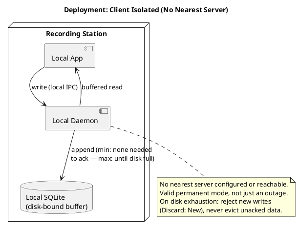
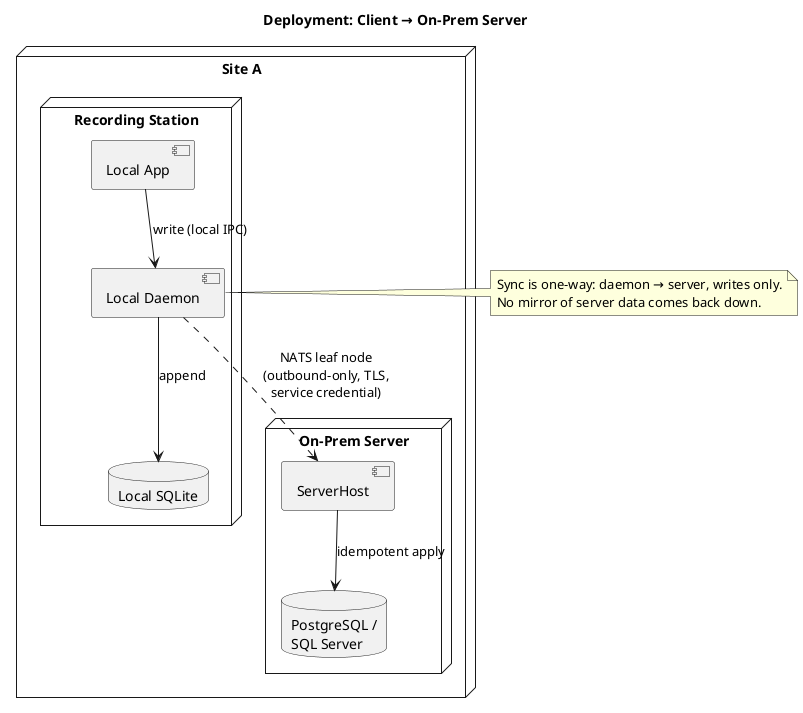
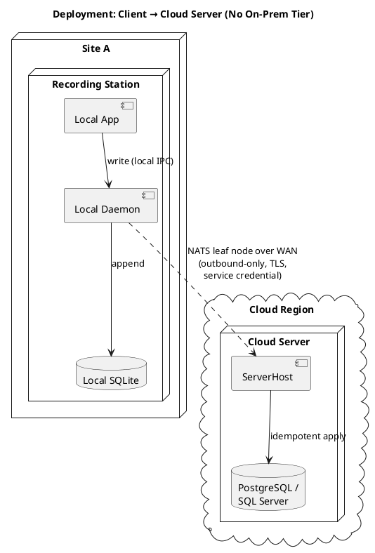
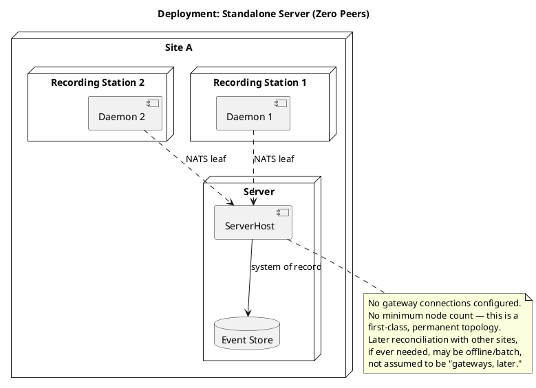
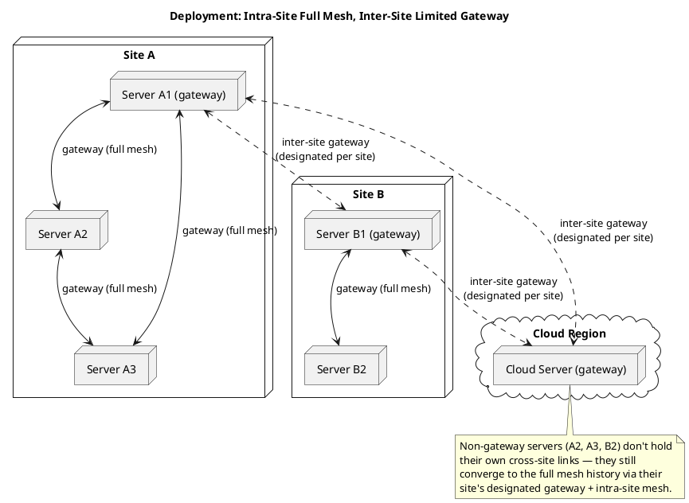
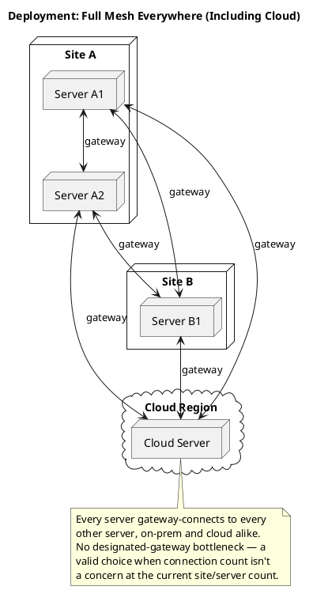

# Deployment Models

Illustrative deployment shapes this architecture supports. None of these are
mutually exclusive or privileged over another — topology is a
deployment/configuration decision, not a code branch (see
`docs/00-design-document.md` §4.2–4.4, Open Question 4, and
`docs/adr/0002-nats-leaf-nodes-for-transport.md`). There is no architectural
minimum or maximum on server, site, or gateway count; the patterns below are
common shapes, not an exhaustive list.

Rendered with any PlantUML renderer (VS Code PlantUML extension,
plantuml.com server, or local `plantuml.jar`) — most tools that support
PlantUML also render fenced ` ```plantuml ` code blocks directly out of
Markdown, per this project's diagram convention (`CLAUDE.md`).

## 1. Client isolated (no nearest server)

A daemon with no nearest server configured or reachable at all. This is a
**valid, potentially permanent** deployment mode, not just a temporary
outage to tolerate — e.g. an air-gapped recording station. Buffered local
read/write both keep working; the write buffer grows until local disk is
exhausted (§4.2's floor/ceiling model applied indefinitely), then rejects
new writes rather than evicting unacknowledged data.



## 2. Client → on-prem server

The common case: a daemon at a site syncs to an on-prem nearest server at
the same site over a NATS leaf connection.



## 3. Client → cloud server (no on-prem tier)

No on-prem server is required at all — a daemon can connect directly to a
cloud-hosted nearest server. This is a fully valid shape, not a degraded
case of pattern 2.



## 4. Standalone server (zero peers)

A single server with no gateway connections to any peer — first-class and
permanent, not a bootstrapping step toward a mesh. Serves one or more
daemons directly.



## 5. Intra-site full mesh, inter-site limited gateway

A common multi-site pattern: servers within a site are fully meshed
(reliable LAN), while cross-site links go through a single/limited
designated gateway server per site — bounding the number of WAN-crossing
connections. Every server everywhere still converges to the same
fully-replicated history (two-way sync); this pattern only changes *how
many* connections carry that convergence.



## 6. Full mesh everywhere (including cloud)

Full mesh is equally valid extending all the way to cloud/remote sites
directly — the designated-gateway pattern above is a preference for
bounding connection count, not a restriction.


