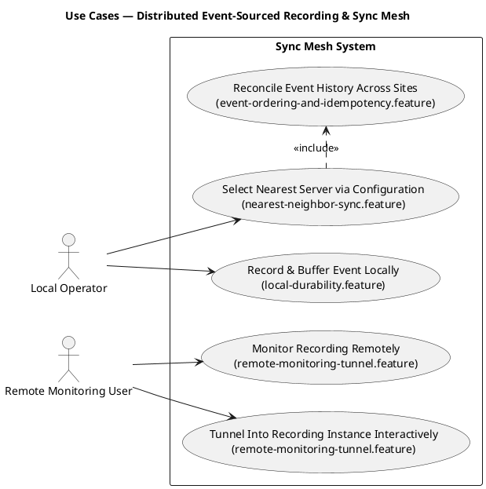

# Use Cases

UML use-case view tying the two actors from the design doc's goals
(`docs/00-design-document.md` §2) to the BDD feature files that make each
use case executable. This is the traceability layer between "who wants
what" and "which `.feature` file proves it" — each `.feature` file's
header comment links back here, and each use case below links forward to
its diagrams.

## UC1 — Record & Buffer Event Locally

- **Actor**: Local Operator
- **Feature file**: [`local-durability.feature`](bdd/features/local-durability.feature)
- **Diagrams**: [Event Recording Flow](sequence-diagrams.md#event-recording-flow--local-app-to-nearest-server), [Component Diagram — Local Daemon](c4-diagrams.md#component-diagram--local-daemon-c4-level-3), [Deployment models](08-deployment-models.md) #1 (client isolated), #2 (client → on-prem), #3 (client → cloud)
- **Design doc**: §4.1–4.2

## UC2 — Select Nearest Server via Configuration

- **Actor**: Local Operator (indirectly — this is an ops/config concern, not something the operator does per-event)
- **Feature file**: [`nearest-neighbor-sync.feature`](bdd/features/nearest-neighbor-sync.feature)
- **Diagrams**: [Event Recording Flow](sequence-diagrams.md#event-recording-flow--local-app-to-nearest-server), [Deployment models](08-deployment-models.md) #2–#6 (every topology shape)
- **Design doc**: §4.3

## UC3 — Reconcile Event History Across Sites

- **Actor**: none directly (system-to-system; included from UC2 once a mesh exists)
- **Feature file**: [`event-ordering-and-idempotency.feature`](bdd/features/event-ordering-and-idempotency.feature), and the multi-site scenarios in [`nearest-neighbor-sync.feature`](bdd/features/nearest-neighbor-sync.feature)
- **Diagrams**: [Server Mesh Reconciliation](sequence-diagrams.md#server-mesh-reconciliation--hlc-ordered-idempotent-apply), [Deployment models](08-deployment-models.md) #5 (intra-site mesh + limited gateway), #6 (full mesh everywhere)
- **Design doc**: §4.4, ADR-0002, ADR-0003

## UC4 — Monitor Recording Remotely

- **Actor**: Remote Monitoring User
- **Feature file**: [`remote-monitoring-tunnel.feature`](bdd/features/remote-monitoring-tunnel.feature) (passive monitoring scenarios)
- **Diagrams**: [Remote Monitoring / Tunnel — Direct-First, Relay Fallback](sequence-diagrams.md#remote-monitoring--tunnel--direct-first-relay-fallback)
- **Design doc**: §4.5

## UC5 — Tunnel Into Recording Instance Interactively

- **Actor**: Remote Monitoring User
- **Feature file**: [`remote-monitoring-tunnel.feature`](bdd/features/remote-monitoring-tunnel.feature) (tunnel/relay scenarios)
- **Diagrams**: [Remote Monitoring / Tunnel — Direct-First, Relay Fallback](sequence-diagrams.md#remote-monitoring--tunnel--direct-first-relay-fallback)
- **Design doc**: §4.5, ADR-0004
