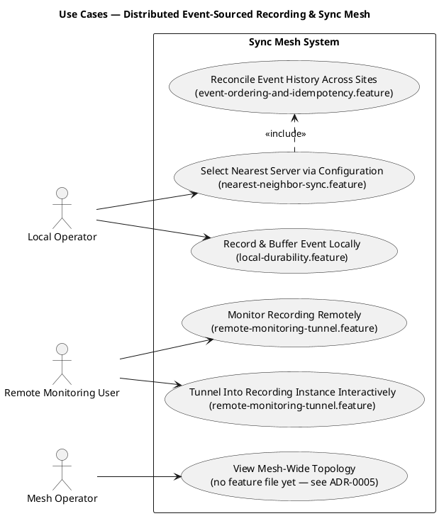

# Use Cases

UML use-case overview tying every actor from the design doc's goals
(`docs/00-design-document.md` §2) to the BDD feature files that make each
use case executable — spans every feature, so it stays here rather than
being owned by one companion doc.

UC1–UC5 now live alongside their owning feature's full design (use case +
sequence diagram + relevant C4 excerpt + deployment-model refs) under
`docs/bdd/design/*.md`, so each feature's design stands on its own:
[local-durability.md](bdd/design/local-durability.md) (UC1),
[nearest-neighbor-sync.md](bdd/design/nearest-neighbor-sync.md) (UC2, UC3),
[event-ordering-and-idempotency.md](bdd/design/event-ordering-and-idempotency.md) (UC3),
[remote-monitoring-tunnel.md](bdd/design/remote-monitoring-tunnel.md) (UC4, UC5).

UC6 stays here — it has no owning feature file yet (see below).

```plantuml
@startuml use-cases
title Use Cases — Distributed Event-Sourced Recording & Sync Mesh

left to right direction

actor "Local Operator" as operator
actor "Remote Monitoring User" as remoteUser
actor "Mesh Operator" as meshOperator

rectangle "Sync Mesh System" {
  usecase "Record & Buffer Event Locally\n(local-durability.feature)" as UC1
  usecase "Select Nearest Server via Configuration\n(nearest-neighbor-sync.feature)" as UC2
  usecase "Reconcile Event History Across Sites\n(event-ordering-and-idempotency.feature)" as UC3
  usecase "Monitor Recording Remotely\n(remote-monitoring-tunnel.feature)" as UC4
  usecase "Tunnel Into Recording Instance Interactively\n(remote-monitoring-tunnel.feature)" as UC5
  usecase "View Mesh-Wide Topology\n(no feature file yet — see ADR-0005)" as UC6
}

operator --> UC1
operator --> UC2
UC2 .> UC3 : <<include>>
remoteUser --> UC4
remoteUser --> UC5
meshOperator --> UC6

@enduml
```

## UC6 — View Mesh-Wide Topology

- **Actor**: Mesh Operator (distinct from Remote Monitoring User — this
  actor watches the whole mesh's shape, not one recording instance)
- **Feature file**: none yet — a gap against this project's "implement
  against feature files" convention, tracked in `WORKPLAN.md` → "Mesh
  Monitor Dashboard"
- **Diagrams**: [Container Diagram](c4-diagrams.md#container-diagram-c4-level-2), [Component Diagram — Mesh Monitor Dashboard](c4-diagrams.md#component-diagram--mesh-monitor-dashboard-c4-level-3), [UI Wireframes](ui-wireframes.md)
- **Design doc**: §4.6, `docs/adr/0005-mesh-monitor-dashboard.md`
