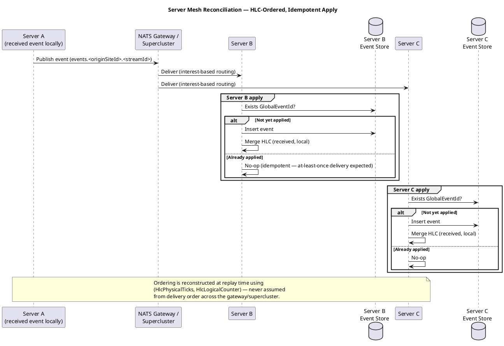

# Cross-Site Event Ordering & Idempotent Apply — Feature Design

> **Generates:** `docs/bdd/features/event-ordering-and-idempotency.feature`
> (build output — do not hand-edit; see `tools/FeatureDocExtractor` and
> `ARCHITECTURE.md` → "Feature-doc extraction tooling"). Edit the
> ```gherkin``` block below instead — that's the source of truth.

## Use Case — UC3: Reconcile Event History Across Sites

- **Actor**: none directly (system-to-system; included from UC2 once a mesh exists)
- **Design doc**: `docs/00-design-document.md` §4.4, ADR-0002, ADR-0003

This feature is the "does it actually reconcile correctly" half of UC3 —
`nearest-neighbor-sync.md` covers the mesh topology/reconciliation
mechanism itself; this feature covers the ordering/idempotency guarantees
that mechanism must uphold under at-least-once delivery, out-of-order
arrival, and network partitions.

## Sequence Diagram — Server Mesh Reconciliation, HLC-Ordered, Idempotent Apply

Shared with `nearest-neighbor-sync.md` — this feature exercises the same
apply/merge flow from the ordering-correctness angle.



## Deployment Models

See `docs/08-deployment-models.md` for full diagrams. This feature applies to:
- **#5 Intra-site full mesh, inter-site limited gateway** — the reconnect-after-partition and multi-site ordering scenarios below assume this shape.
- **#6 Full mesh everywhere (including cloud)** — same ordering/idempotency guarantees hold regardless of which gateway pattern is used.

## Gherkin

```gherkin
Feature: Cross-site event ordering and idempotent apply
  As the server mesh
  I want to apply events idempotently and reconstruct correct ordering using hybrid logical clocks
  So that the event history is correct even under at-least-once delivery and network partitions

  Background:
    Given multiple sites are producing events independently
    And each event carries a GlobalEventId, OriginSiteId, and HybridLogicalClock value

  Scenario: Duplicate delivery of the same event is a safe no-op
    Given an event with GlobalEventId "abc-123" has already been applied at Server B
    When Server B receives the same event again (at-least-once redelivery)
    Then Server B does not insert a duplicate record
    And Server B's event store state is unchanged by the redelivery

  Scenario: Events from two sites are ordered correctly on replay despite out-of-order arrival
    Given Server B receives an event from Site A with HLC value earlier than an event from Site C
    When Server B receives the Site C event before the Site A event
    Then replaying Server B's event store produces the events in HLC order, not arrival order

  Scenario: Clock merge preserves causal ordering after receiving a remote event
    Given a site's local HLC counter is at a known state
    When the site receives an event from another site with a later physical time
    Then the site's local HLC is merged forward to reflect the later time
    And subsequent locally generated events have HLC values greater than the merged value

  Scenario: Reconnection after extended partition does not corrupt ordering
    Given a site has been disconnected from the mesh for an extended period
    And both the disconnected site and the connected mesh have continued producing events
    When the disconnected site reconnects and exchanges event logs
    Then all events from both sides are present in the reconciled history
    And the reconciled history's replay order is consistent with each event's HLC value

  Scenario: Leaf node reconnect-sync gap is explicitly tested, not assumed safe
    Given a daemon's leaf node has been disconnected from its nearest server for longer than a typical outage
    When connectivity is restored
    Then all events buffered locally during the disconnection are confirmed present at the nearest server
    And any gap between "documented behavior" and "observed behavior" is captured as a defect, not silently tolerated
```
