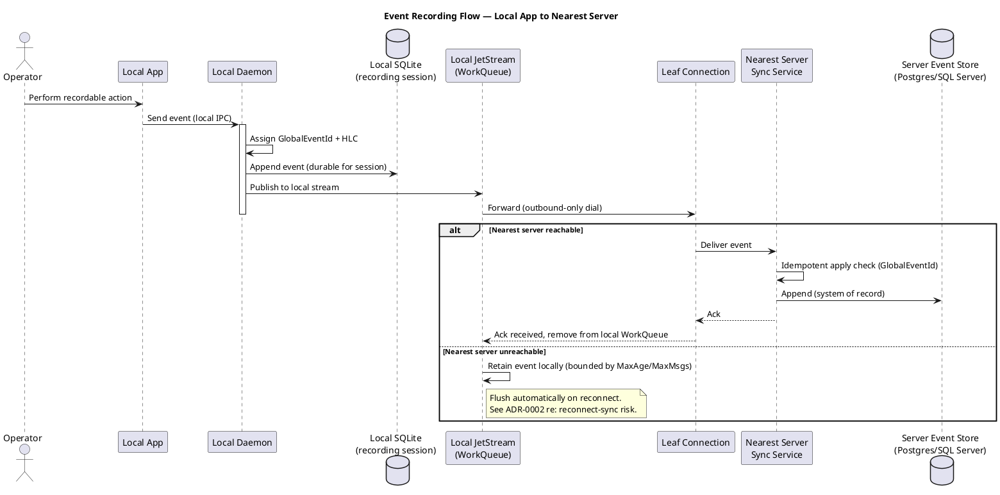

# Local Daemon Durability — Feature Design

> **Generates:** `docs/bdd/features/local-durability.feature` (build output
> — do not hand-edit; see `tools/FeatureDocExtractor` and `ARCHITECTURE.md`
> → "Feature-doc extraction tooling"). Edit the ```gherkin``` block below
> instead — that's the source of truth.

## Use Case — UC1: Record & Buffer Event Locally

- **Actor**: Local Operator
- **Design doc**: `docs/00-design-document.md` §4.1–4.2
- **Related deployment models**: see below

The local daemon durably buffers events only during an active recording
session — the local app never talks to anything but its own daemon, and
the daemon buffers durably until the nearest server acknowledges, without
ever becoming a permanent store in its own right.

## Sequence Diagram — Event Recording Flow, Local App to Nearest Server



## Component Diagram — Local Daemon (C4 Level 3)

```plantuml
@startuml component-daemon
!include https://raw.githubusercontent.com/plantuml-stdlib/C4-PlantUML/master/C4_Component.puml

title Component Diagram — Local Daemon

Container_Boundary(daemon, "Local Daemon") {
    Component(ipcListener, "IPC Listener", "Named pipe / gRPC server", "Accepts events from the local app")
    Component(eventWriter, "Local Event Writer", "EF Core + SQLite", "Appends incoming events; assigns HLC + GlobalEventId")
    Component(hlcGen, "HLC Generator", "C# component", "Assigns/merges hybrid logical clocks")
    Component(leafPublisher, "Leaf Publisher", "NATS client", "Publishes buffered events to local JetStream stream")
    Component(jetstream, "Local JetStream Stream", "NATS JetStream, WorkQueue retention", "Short-lived durable buffer")
    Component(leafConn, "Leaf Node Connection", "Embedded nats-server (leaf mode)", "Outbound-only connection to nearest server")
    Component(monitorPublisher, "Monitor Publisher", "NATS client", "Publishes telemetry to monitor.* subjects")
    Component(tunnelAgent, "Tunnel Agent", "frp/chisel client or overlay agent", "Attempts direct connectivity; else awaits relay")
}

Rel(ipcListener, eventWriter, "Passes captured event")
Rel(eventWriter, hlcGen, "Requests next HLC value")
Rel(eventWriter, leafPublisher, "Hands off event for forwarding")
Rel(leafPublisher, jetstream, "Publishes into")
Rel(jetstream, leafConn, "Delivered via, once acked upstream, entry removed (WorkQueue)")
Rel(eventWriter, monitorPublisher, "Emits status/metrics")
Rel(monitorPublisher, leafConn, "Publishes monitor.* subjects via")
Rel(tunnelAgent, leafConn, "Signals control state via tunnel.* subjects (separate from event subjects)")

@enduml
```

## Deployment Models

See `docs/08-deployment-models.md` for full diagrams. This feature applies to:
- **#1 Client isolated** — the daemon's durability guarantees hold with no nearest server at all, permanently, not just during an outage.
- **#2 Client → on-prem server** — the common case this feature's Background assumes.
- **#3 Client → cloud server** — same guarantees, no on-prem tier required.

## Gherkin

```gherkin
Feature: Local daemon durability during recording
  As a system operator
  I want the local daemon to durably buffer events only during an active recording session
  So that no events are lost during transient connectivity loss, without the daemon becoming a permanent store

  Background:
    Given a local daemon is running with an embedded NATS leaf node
    And the daemon's local JetStream stream uses WorkQueue retention

  Scenario: Event is retained locally until the nearest server acknowledges it
    Given the local app sends an event to the daemon
    When the nearest server is temporarily unreachable
    Then the event is durably stored in the local buffer
    And the event is not lost if the daemon process restarts
    And the event remains in the local buffer until upstream acknowledgment is received

  Scenario: Event is removed from local buffer after upstream acknowledgment
    Given an event has been durably stored in the local buffer
    When the nearest server acknowledges receipt of the event
    Then the event is removed from the local buffer
    And the local buffer does not grow unbounded over the course of a recording session

  Scenario: Local buffer defaults to using all available disk, not a small fixed cap
    Given no explicit buffer capacity has been configured
    When events accumulate in the local buffer during an extended outage
    Then the buffer continues to accept new events until local disk is actually exhausted
    And no arbitrary time- or count-based ceiling is applied by default

  Scenario: Local buffer respects a configured capacity cap when one is set
    Given the local buffer has been configured with an explicit MaxBytes, MaxAge, or MaxMsgs cap smaller than available disk
    When the nearest server is unreachable for longer than expected
    And the buffer reaches its configured cap
    Then new local writes are rejected rather than evicting unacknowledged events
    And the system surfaces an explicit operational warning
    And the behavior on cap overflow is a deliberate, documented decision (not silent data loss)

  Scenario: Recording session ends and buffer is not treated as a system of record
    Given a recording session has ended
    And all events from that session have been acknowledged upstream
    Then the local buffer contains no residual events from that session
    And no component depends on the local buffer for historical event retrieval

  Scenario: Local app reads back what it has already recorded this session
    Given the local app has sent several events to the daemon during this session
    When the local app requests a read of that stream
    Then the daemon returns the events from its own local store, ordered by stream version
    And the daemon does not proxy the read to or from the nearest server

  Scenario: Daemon operates durably with no nearest server configured at all
    Given the daemon has no nearest-server connection configured or reachable
    When the local app sends events to the daemon over an extended period
    Then each event is durably stored in the local buffer exactly as it would be during a temporary outage
    And the local app can still read back everything it has recorded
    And this is treated as a valid, permanent deployment mode, not merely an outage to tolerate
```
