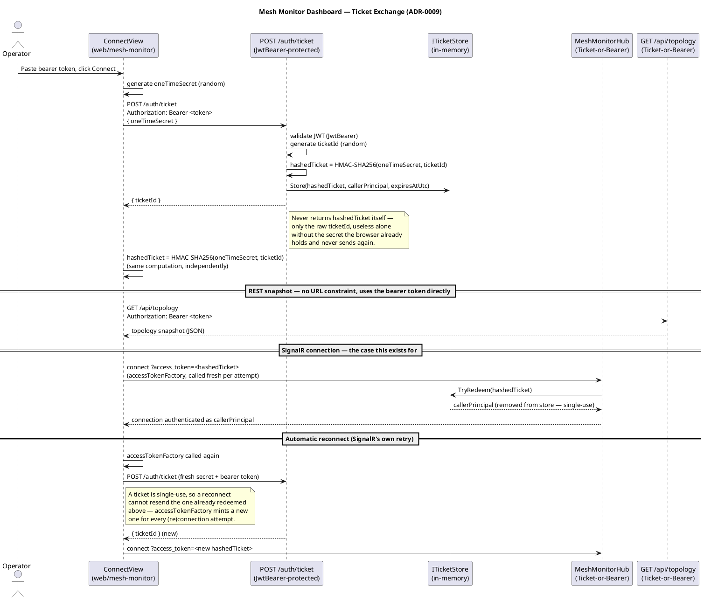

# Mesh Monitor Dashboard: Ticket-Based Authentication — Feature Design

No `docs/bdd/features/*.feature` is generated from this doc — matching
the rest of the Mesh Monitor Dashboard (see ADR-0005/ADR-0009 and
`WORKPLAN.md` → "Mesh Monitor Dashboard"), this is developer tooling
built alongside the phases, not a phase deliverable with its own
entry/exit criteria. Unit tests (`tests/SyncMesh.MeshMonitor.Tests`,
`web/mesh-monitor/tests/unit/{auth,authStore}.spec.ts`) are the
right-sized coverage for this; a full Gherkin/Reqnroll suite would be
scope creep for it. This doc still stands on its own the same way a
BDD-tracked feature's design doc does — use case, sequence diagram, C4
component excerpt, wireframe — just without the Gherkin section.

## Use Case

**Authenticate the Mesh Monitor Dashboard without ever putting a bearer
token in a URL.**

- **Actor**: Mesh Operator (the human using `web/mesh-monitor`)
- **Design doc**: ADR-0009, ADR-0005 §4.6
- **Problem**: `MeshMonitorHub` (SignalR) needs to authenticate its
  connection, but a browser's WebSocket handshake can't set a custom
  `Authorization` header — the standard fix (a bearer token in the
  connection URL's query string) puts a long-lived, high-value credential
  somewhere it's routinely logged (web server access logs, reverse-proxy
  logs, browser history).
- **Resolution**: exchange the real bearer token, once, via header, for a
  short-lived single-use ticket that's safe to put in a URL instead. See
  ADR-0009 for the full design rationale and the alternatives considered.

## Sequence Diagram — Ticket Exchange



## Component Diagram (C4 Level 3)

Extends the Mesh Monitor Dashboard component diagram in
`docs/c4-diagrams.md` with the auth-specific pieces — see that file for
the non-auth components (`MonitorSubscriber`, `TopologyStore`, etc.),
unchanged by this feature.

```plantuml
@startuml component-mesh-monitor-ticket-auth
!include https://raw.githubusercontent.com/plantuml-stdlib/C4-PlantUML/master/C4_Component.puml

title Component Diagram — Mesh Monitor Ticket Exchange

Container_Boundary(meshMonitorApi, "Mesh Monitor Dashboard — Backend (SyncMesh.MeshMonitor.Api)") {
    Component(jwtBearer, "JwtBearer Scheme", "Microsoft.AspNetCore.Authentication.JwtBearer", "Validates a real bearer token signed with MeshMonitorAuthOptions.SigningKey")
    Component(ticketScheme, "Ticket Scheme", "TicketAuthenticationHandler", "Redeems a hashed ticket from ?access_token=/?ticket= or Authorization: Ticket <hash>, exactly once")
    Component(ticketEndpoint, "POST /auth/ticket", "Minimal API, Bearer-only", "Exchanges a one-time secret + the caller's bearer identity for an opaque ticketId")
    Component(ticketStore, "ITicketStore", "In-memory ConcurrentDictionary", "hashedTicket -> (ClaimsPrincipal, expiresAtUtc); TryRedeem removes on lookup, valid or not")
    Component(ticketCleanup, "TicketCleanupService", "BackgroundService", "Periodic sweep for tickets issued but never redeemed")
    Component(topologyApi, "GET /api/topology", "Minimal API, Bearer-or-Ticket", "Existing endpoint from docs/c4-diagrams.md, now behind auth")
    Component(monitorHub, "MeshMonitorHub", "SignalR, Bearer-or-Ticket", "Existing hub from docs/c4-diagrams.md, now behind auth")
}

Container_Boundary(dashboard, "web/mesh-monitor (Frontend)") {
    Component(connectView, "ConnectView", "Vue component", "Token entry screen; gates the rest of the app until authenticated")
    Component(authStore, "authStore", "Pinia store (ViewModel)", "Holds the bearer token in memory; mints a fresh ticket per SignalR (re)connection attempt")
    Component(authService, "services/auth.ts", "mintTicket / computeHashedTicket", "Calls POST /auth/ticket, computes HMAC-SHA256 client-side via Web Crypto")
}

Rel(connectView, authStore, "setToken() on Connect")
Rel(authStore, authService, "getSignalRAccessToken() -> mintTicket()")
Rel(authService, ticketEndpoint, "POST /auth/ticket\nAuthorization: Bearer <token>")
Rel(ticketEndpoint, jwtBearer, "Requires this scheme specifically")
Rel(ticketEndpoint, ticketStore, "Store(hashedTicket, principal, expiry)")
Rel(authStore, monitorHub, "connect(accessTokenFactory: getSignalRAccessToken)")
Rel(monitorHub, ticketScheme, "Authenticate via")
Rel(ticketScheme, ticketStore, "TryRedeem(hashedTicket)")
Rel(authStore, topologyApi, "GET /api/topology\nAuthorization: Bearer <token> (direct — no ticket needed)")
Rel(topologyApi, jwtBearer, "Authenticate via")
Rel(ticketCleanup, ticketStore, "PurgeExpired() every 30s")

@enduml
```

## Wireframe

See `docs/ui-wireframes.md` → "Layer 0 — Connect Screen," added alongside
this feature — the new screen that now gates every other layer in that
file.

## Related

`docs/adr/0009-ticket-based-signalr-auth.md` (the design decision this
doc diagrams), `docs/adr/0005-mesh-monitor-dashboard.md` (the dashboard
this protects), `ARCHITECTURE.md` → "Mesh-wide monitoring dashboard and
deployment-model sandbox," `UI-ARCHITECTURE.md` (frontend conventions
this feature follows: component file split, MVVM/Pinia, `useCommand`),
`docs/c4-diagrams.md` (the dashboard's non-auth components).
