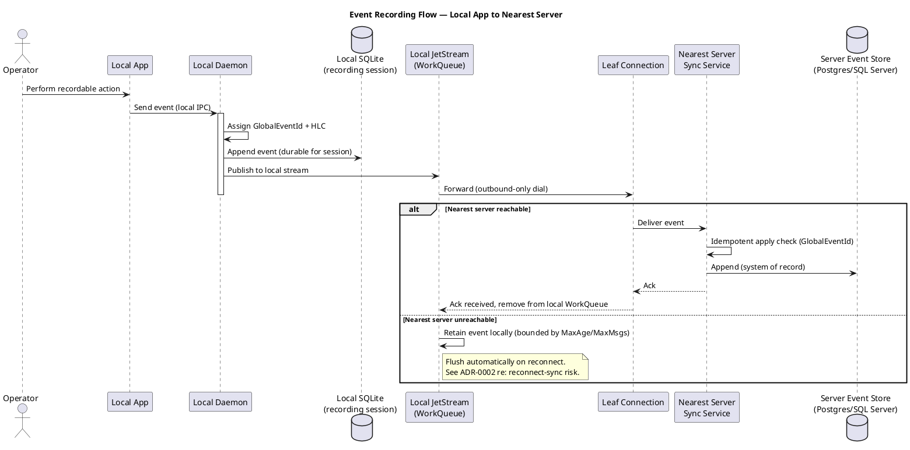
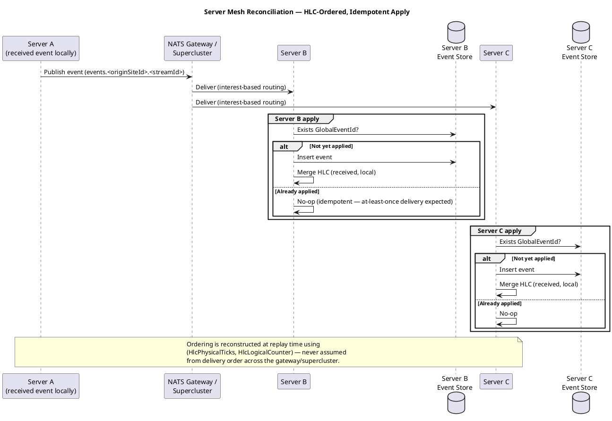

# Nearest-Neighbor Sync & Server Mesh — Feature Design

> **Generates:** `docs/bdd/features/nearest-neighbor-sync.feature` (build
> output — do not hand-edit; see `tools/FeatureDocExtractor` and
> `ARCHITECTURE.md` → "Feature-doc extraction tooling"). Edit the
> ```gherkin``` block below instead — that's the source of truth.

## Use Cases

### UC2: Select Nearest Server via Configuration

- **Actor**: Local Operator (indirectly — this is an ops/config concern, not something the operator does per-event)
- **Design doc**: `docs/00-design-document.md` §4.3

### UC3: Reconcile Event History Across Sites

- **Actor**: none directly (system-to-system; included from UC2 once a mesh exists)
- **Design doc**: `docs/00-design-document.md` §4.4, ADR-0002, ADR-0003

## Sequence Diagrams

### Event Recording Flow — Local App to Nearest Server

Shared with `local-durability.md` — the "nearest server" selection this
feature governs is the same connection the daemon uses to forward events.



### Server Mesh Reconciliation — HLC-Ordered, Idempotent Apply



## Deployment Models

See `docs/08-deployment-models.md` for full diagrams. This feature spans
**all six** topology shapes — it's the feature that governs how a daemon
picks its nearest server and how servers reconcile with each other:
- **#1 Client isolated** — the degenerate "no nearest server" case.
- **#2 Client → on-prem server** / **#3 Client → cloud server** — config-only switch between them.
- **#4 Standalone server (zero peers)** — a first-class, permanent deployment mode.
- **#5 Intra-site full mesh, inter-site limited gateway** — the common multi-site pattern.
- **#6 Full mesh everywhere (including cloud)** — equally valid, no architectural minimum/maximum on server or site count.

## Gherkin

```gherkin
Feature: Nearest-neighbor sync with configuration-driven environment selection
  As an operator deploying the daemon in different environments
  I want the "nearest server" to be selected via configuration
  So that switching between on-prem, WAN, and cloud requires no code changes

  Background:
    Given the daemon is configured with a nearest-server connection profile

  Scenario: Daemon connects to an on-prem nearest server
    Given the connection profile specifies an on-prem NATS cluster URL
    When the daemon starts
    Then the daemon establishes a leaf node connection to the on-prem cluster
    And no code changes were required to target this environment

  Scenario: Daemon connects directly to a cloud nearest server with no on-prem tier
    Given the connection profile specifies a cloud NATS cluster URL and no on-prem server is deployed
    When the daemon starts
    Then the daemon establishes a leaf node connection directly to the cloud cluster
    And no on-prem server is required for the daemon to operate correctly

  Scenario: Switching from on-prem to cloud is a configuration change only
    Given the daemon was previously connected to an on-prem nearest server
    When the connection profile is updated to point to a cloud NATS cluster
    And the daemon is restarted (or reloads configuration)
    Then the daemon establishes a leaf node connection to the cloud cluster
    And event forwarding continues to function without code modification

  Scenario: Daemon connectivity survives firewall/NAT without inbound rules
    Given the daemon is behind a firewall with no inbound rules configured
    When the daemon dials out to its configured nearest server
    Then the leaf node connection is established successfully
    And no inbound port forwarding was required

  Scenario: A standalone server with no peer connections operates correctly and permanently
    Given a server has no gateway connections configured to any peer
    When daemons connect to it and forward events
    Then the server durably stores and serves those events as a complete system of record on its own
    And this is a first-class, permanent deployment mode, not a bootstrapping step toward a mesh

  Scenario: Server mesh reconciles events from multiple sites
    Given Server A and Server B are connected via a gateway/supercluster connection
    When Server A receives a new event from its local daemon
    Then Server B eventually receives and applies the same event
    And Server A eventually receives and applies any event Server B produces locally, the same way
    And the reconciliation does not require synchronous coordination between A and B

  Scenario: Servers within a site are fully meshed by default; cross-site links use a limited gateway
    Given multiple servers are deployed at the same site
    And a separate site (or cloud region) is also deployed
    When gateway connections are configured
    Then the servers within the same site are connected to each other directly (full mesh)
    And only a single or limited set of designated gateway servers per site carries the cross-site connection
    And every server at every site still converges to the same fully-replicated event history

  Scenario: Full mesh is equally valid extending directly to cloud or remote sites
    Given an operator chooses to configure every server, on-prem and cloud alike, as a direct gateway peer of every other server
    When this topology is deployed
    Then it is fully supported, with no architectural minimum or maximum on server or site count
    And it converges to the same fully-replicated event history as the limited-gateway pattern
```
