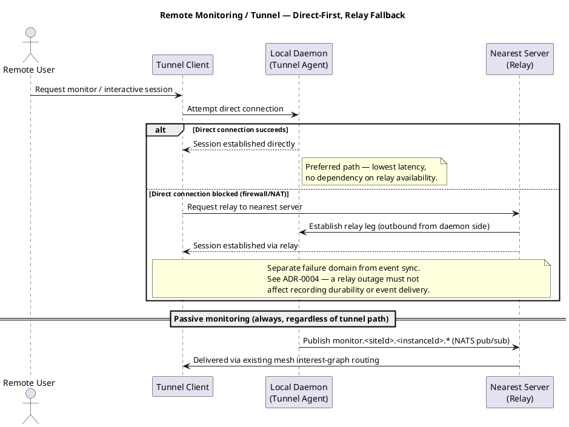

# Remote Monitoring & Tunnel Fallback — Feature Design

> **Generates:** `docs/bdd/features/remote-monitoring-tunnel.feature`
> (build output — do not hand-edit; see `tools/FeatureDocExtractor` and
> `ARCHITECTURE.md` → "Feature-doc extraction tooling"). Edit the
> ```gherkin``` block below instead — that's the source of truth.

## Use Cases

### UC4: Monitor Recording Remotely

- **Actor**: Remote Monitoring User
- **Design doc**: `docs/00-design-document.md` §4.5

### UC5: Tunnel Into Recording Instance Interactively

- **Actor**: Remote Monitoring User
- **Design doc**: `docs/00-design-document.md` §4.5, ADR-0004

## Sequence Diagram — Remote Monitoring / Tunnel, Direct-First, Relay Fallback



## Deployment Models

Not topology-specific — this feature's guarantees (direct-first/relay-
fallback, failure-domain isolation from event sync) hold regardless of
which shape in `docs/08-deployment-models.md` a given site uses.

## Gherkin

```gherkin
Feature: Remote monitoring and tunnel fallback via nearest server
  As a remote monitoring user
  I want to observe or interactively access a recording instance directly when possible
  So that I have low-latency access, with a reliable fallback when firewalls block direct connectivity

  Background:
    Given a recording instance is actively recording
    And a remote user has valid credentials to monitor or tunnel to it

  Scenario: Direct tunnel connection succeeds when network allows it
    Given the remote user's client can reach the daemon directly
    When the remote user requests an interactive session
    Then the session is established directly, without relaying through the nearest server

  Scenario: Tunnel falls back to relay when direct connection is blocked
    Given the remote user's client cannot reach the daemon directly (firewall/NAT)
    When the remote user requests an interactive session
    Then the client attempts direct connection first
    And upon failure, falls back to relaying through the nearest server
    And the session is established via the relay

  Scenario: Tunnel and monitoring connections authenticate as a service, not as the end user
    Given the daemon and the nearest server both have a registered service credential
    When a direct or relayed tunnel/monitoring connection is established
    Then the connection is TLS-secured and authenticated using the registered service credential
    And the remote user's own authorization for what they can view or control is enforced as a separate layer on top of that connection

  Scenario: Passive monitoring works regardless of tunnel path availability
    Given the interactive tunnel path is currently blocked and no relay session is active
    When the daemon publishes telemetry to its monitor subject
    Then the remote user still receives monitoring data via the existing event-mesh routing

  Scenario: Tunnel/relay outage does not affect event sync
    Given the tunnel relay mechanism is unavailable or failing
    When the local daemon continues recording and forwarding events
    Then event durability and forwarding to the nearest server are unaffected
    And no event-sync component depends on the tunnel/relay mechanism being healthy

  Scenario: Event-sync outage does not affect monitoring/tunnel
    Given the event-sync mesh is degraded or unavailable
    When a remote user requests a direct or relayed interactive session
    Then the tunnel/monitoring path functions independently of event-sync health
```
