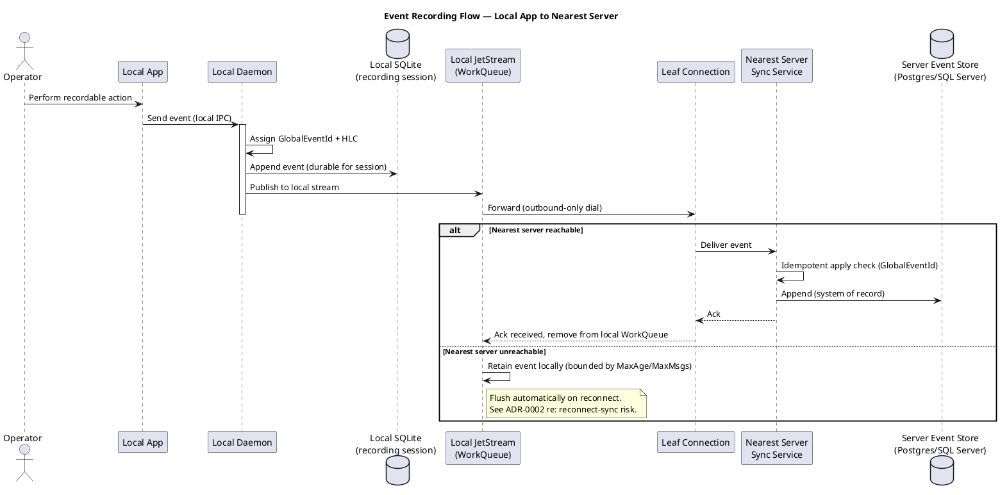
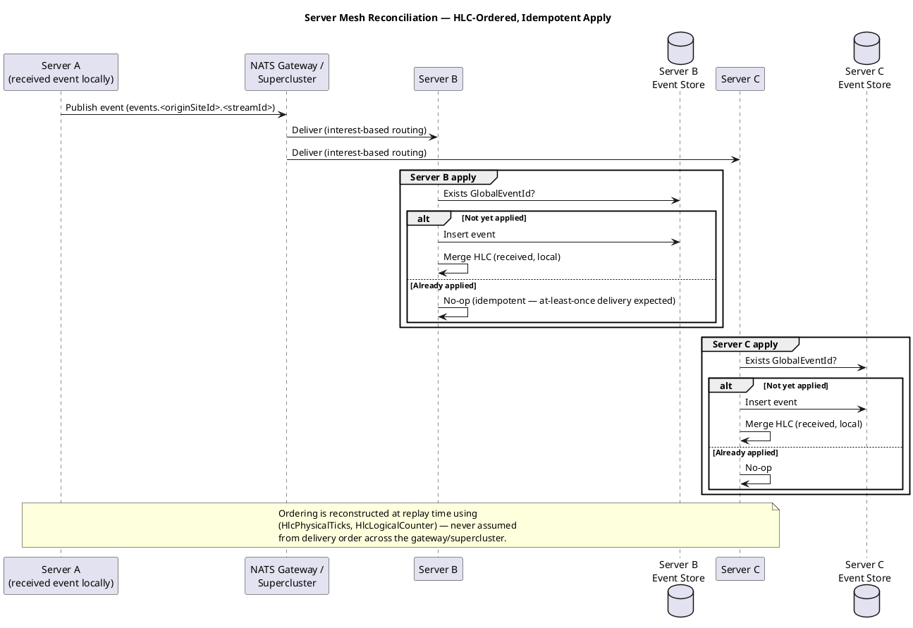
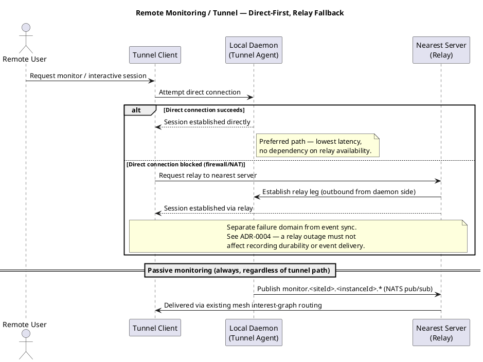

# Sequence Diagrams

PlantUML sequence diagrams for the key flows across the recording, sync,
and monitoring/tunnel tiers. Render with any PlantUML renderer (VS Code
PlantUML extension, plantuml.com server, or local `plantuml.jar`) — most
tools that support PlantUML also render fenced ` ```plantuml ` code blocks
directly out of Markdown.

## Event Recording Flow — Local App to Nearest Server



## Server Mesh Reconciliation — HLC-Ordered, Idempotent Apply



## Remote Monitoring / Tunnel — Direct-First, Relay Fallback


