# <Feature Name> — Feature Design

> **Generates:** `docs/bdd/features/<feature-name>.feature` (build output
> — do not hand-edit; see `tools/FeatureDocExtractor` and
> `ARCHITECTURE.md` → "Feature-doc extraction tooling"). Edit the
> ```gherkin``` block below instead — that's the source of truth.

## Use Case

```plantuml
@startuml <diagram-id>
title <Flow Name>

' ... participants, messages ...

@enduml
```

- **Actor**: <who wants this>
- **Design doc**: <relevant `docs/00-design-document.md` section(s)>

<One or two sentences: what this feature is and why it exists.>

## Sequence Diagram — <Flow Name>



## Component Diagram — <Component Name> (C4 Level 3)

<Only include this section if this feature owns a component diagram —
most features won't. Cross-cutting/not-yet-feature-owned component
diagrams stay in docs/c4-diagrams.md instead.>

```plantuml
@startuml <diagram-id>
!include https://raw.githubusercontent.com/plantuml-stdlib/C4-PlantUML/master/C4_Component.puml

title Component Diagram — <Component Name>

' ... components, relationships ...

@enduml
```

## Deployment Models

See `docs/08-deployment-models.md` for full diagrams — link + a 1–2
sentence summary per applicable shape here, don't duplicate the diagrams
themselves (that doc is shared across features; duplicating multiplies
drift risk for content this feature doesn't uniquely own).

- **#N <shape name>** — <why/how this feature applies to it>

## Gherkin

```gherkin
Feature: <Short, capability-oriented name>
  As a <role>
  I want <capability>
  So that <business/technical value>

  Background:
    Given <shared setup for all scenarios in this feature>

  Scenario: <specific, concrete behavior>
    Given <precondition>
    And <additional precondition>
    When <action>
    Then <observable outcome>
    And <additional observable outcome>

  Scenario: <edge case or failure mode>
    Given <precondition>
    When <action that triggers the edge case>
    Then <expected safe/correct behavior — not just "it doesn't crash">
```
