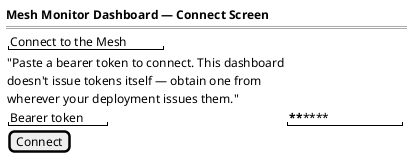
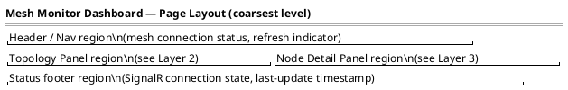
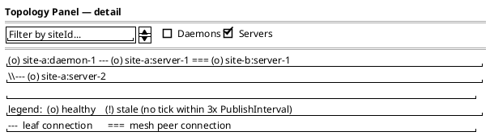
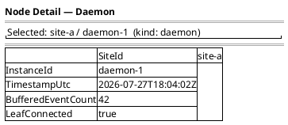
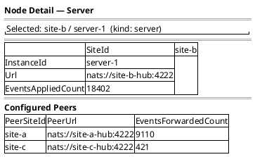

# UI Wireframes

Salt wireframes for the Mesh Monitor Dashboard (`SyncMesh.MeshMonitor.Api` +
`web/mesh-monitor`, its Vue SPA — see ADR-0005). This is the first UI work
in the project, per `CLAUDE.md`'s "Salt for UI wireframes if/when UI work
starts."

Render with any PlantUML renderer that supports Salt (VS Code PlantUML
extension, plantuml.com server, or local `plantuml.jar`) — fenced
` ```plantuml ` blocks render directly out of Markdown, same convention as
`docs/c4-diagrams.md` and the per-feature diagrams in `docs/bdd/design/*.md`.

## Why these are layered, not one mockup

These wireframes deliberately mirror the C4 model's context → container →
component progression instead of jumping straight to one fully-detailed
screen:

0. **Layer 0 — Connect Screen.** Gates every other layer below — see
   `docs/bdd/design/mesh-monitor-ticket-auth.md`/ADR-0009. Not part of the
   original C4 progression (added later, alongside auth), so numbered 0
   rather than renumbering the layers that already matched Context/
   Container/Component.
1. **Layer 1 — Page layout.** Just the regions on the page and how they
   relate, no widget-level detail. Equivalent to a C4 Context diagram.
2. **Layer 2 — Topology Panel detail.** A zoomed-in look at *one* Layer-1
   region, with its own controls and content spelled out. Equivalent to a
   C4 Container diagram — one box from Layer 1, one level deeper.
3. **Layer 3 — Node Detail Panel detail.** A zoomed-in look at the *other*
   Layer-1 region, spelled out for each node kind it needs to render.
   Equivalent to a C4 Component diagram.

Each layer only adds detail to the region it's zooming into; it doesn't
restate the whole page. This keeps each diagram legible on its own and
keeps a later change (e.g. redesigning just the node detail panel) from
requiring the whole wireframe set to be redrawn.

## Layer 0 — Connect Screen (gates every layer below)



- Shown whenever `authStore.isAuthenticated` is false — i.e. on first
  load, and again if the operator explicitly disconnects. Nothing past
  this screen (Layers 1-3 below) renders until a token is entered.
- No login flow, no username/password — this project doesn't issue
  bearer tokens itself (ADR-0009); the operator is expected to already
  have one from wherever their deployment issues them.
- On submit: `authStore.setToken()`, then `meshStore.loadSnapshot()` +
  `meshStore.connectLive()` — see
  `docs/bdd/design/mesh-monitor-ticket-auth.md`'s sequence diagram for
  what happens next (the ticket exchange, not visible to the operator).
- An error here (invalid token, network failure) shows inline and does
  **not** advance past this screen — see `ConnectView.ts`'s
  `connectCommand`.

## Layer 1 — Page Layout



- **Header/nav**: which hub(s) this dashboard instance is connected to
  (`MeshMonitorApiOptions.NatsUrls` — one per site in a multi-site mesh),
  and whether the SignalR connection is live.
- **Topology panel**: left region, the mesh-wide node/edge view — detailed
  in Layer 2.
- **Node detail panel**: right region, populated once a node is selected in
  the topology panel — detailed in Layer 3 (its content depends on whether
  a `DaemonStatus` or `ServerStatus` node is selected).
- **Footer**: connection health for the dashboard itself, not the mesh —
  distinguishes "the mesh has a problem" from "this browser tab lost its
  SignalR connection."

## Layer 2 — Topology Panel (zoom of Layer 1's left region)



- Node markers distinguish daemon vs. server (icon/shape, not just color —
  color alone isn't accessible).
- "Stale" is derived client-side from `LastSeenUtc` vs. a multiple of the
  publisher's own `PublishInterval` — the dashboard doesn't invent a new
  liveness signal, it just ages out what it already receives, consistent
  with monitoring being current-state-only (`ARCHITECTURE.md` → Passive
  monitoring).
- Edge kind (leaf vs. mesh peer) comes from which contract reported the
  relationship: a daemon reports its own nearest-server URL; a server
  reports `ConfiguredPeers`. The dashboard draws both from self-reported
  telemetry, never a separately maintained topology file — same principle
  ADR-0005 and the `ServerStatus` contract doc comment already state.

## Layer 3 — Node Detail Panel (zoom of Layer 1's right region)

Two variants, since `DaemonStatus` and `ServerStatus` don't share a shape.

### Daemon node selected



### Server node selected



- Field lists here are a direct render of `SyncMesh.Contracts.DaemonStatus`
  / `ServerStatus` — the dashboard is not expected to derive or compute
  anything beyond what a node already self-reports.
- A standalone server (zero peers, §4.4) renders with an empty Configured
  Peers table, not a hidden section — absence of peers is itself meaningful
  state, not missing data.

## Status

Wireframe only — no frontend code exists yet (`web/mesh-monitor` is not
present in the repo). See ADR-0005 and `WORKPLAN.md` → "Mesh Monitor
Dashboard" for what's actually built versus planned.
